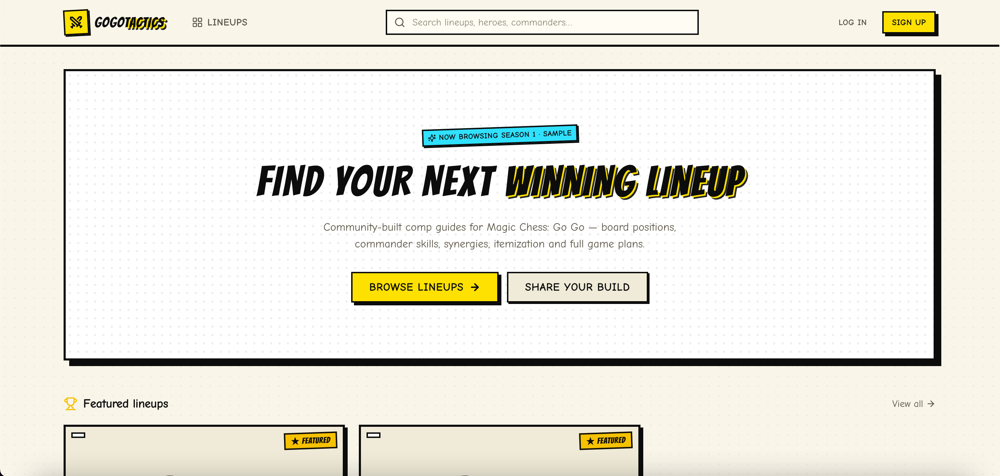

# GoGoTactics

Community-driven lineup platform for **Magic Chess: Go Go** — browse, build, and share tactical lineups with a visual board editor, ratings, comments, follows, and moderation tooling.

<p align="center">
  
</p>

> Fan-made demo project. All game data (seasons, commanders, heroes, synergies, equipment) is sample content rendered dynamically — no real game assets are used or distributed.

## ⚠️ Disclaimers — please read

**This is a vibe-coded project.** It was built with the **Big Pickle** model
(`opencode/big-pickle`) in [OpenCode](https://opencode.ai) — an AI coding agent.
The code was generated and iterated on conversationally: prompts in, working app
out, review-and-patch cycles until it looked right. Treat it as a hobby
prototype, not a production codebase. Read it before you run it.

**Not affiliated with Moonton.** *Magic Chess: Go Go* (MCGG) is a game by
**Moonton**. GoGoTactics is **not** associated with, sponsored by, endorsed by,
or connected in any way to Moonton or the official MCGG team. It is an
independent fan project.

**No economic benefit.** This project exists purely as a personal, non-commercial
hobby. It is not monetised, has no ads, no paywalls, no tracking, no analytics,
and no premium tiers. Nothing here is sold, licensed, or operated for profit.
The name and the game it references belong to their respective owners.

**No game assets.** No Moonton artwork, audio, code, or data is included,
redistributed, or scraped. Every commander, hero, synergy and lineup in the
seeded database is original fiction written for this demo.

---

## Quick start — one command

Requires [Docker](https://docs.docker.com/get-docker/) + Docker Compose v2.

```bash
git clone <your-fork-url> gogotactics && cd gogotactics
docker compose up -d --build
docker compose run --rm seed        # optional: load the sample data
open http://localhost:8080
```

That is the whole setup: MongoDB, the API and the web client come up together,
each in its own container, each healthy-checked. Details and every knob are in
[Running with Docker](#running-with-docker).

<details>
<summary>Prefer running it locally with Node?</summary>

```bash
cd server && npm install && cp .env.example .env && npm run seed && npm run dev
cd client && npm install && cp .env.example .env && npm run dev   # http://localhost:5173
```

</details>

## Tech Stack

| Layer    | Tech                                                                 |
| -------- | -------------------------------------------------------------------- |
| Frontend | React 18, TypeScript 5, Vite 6, Tailwind CSS v4, TanStack Query, React Router 6 |
| UI       | Radix UI primitives, lucide-react, sonner (toasts), dnd-kit (board editor) |
| Backend  | Node.js ≥ 20, Express 4, TypeScript                                  |
| Database | MongoDB + Mongoose                                                   |
| Auth     | JWT in httpOnly cookies, bcrypt password hashing                     |
| Uploads  | Cloudinary (avatars, lineup thumbnails, game-data images)            |
| SEO      | react-helmet-async meta tags + JSON-LD structured data               |
| Deploy   | Docker + Docker Compose (nginx static client, Node API, MongoDB)     |

The UI follows a **tactical-manga / comic-book design system** — see [`DESIGN.md`](./DESIGN.md).

## Architecture

```
┌──────────────────────────┐        HTTPS / CORS         ┌──────────────────────────┐
│  client/  (React SPA)    │  ────────────────────────▶ │  server/  (Express API)   │
│  static bundle + nginx   │        JSON over /api/v1    │  stateless REST + JWT    │
│  runtime-configurable    │ ◀────────────────────────  │  zod-validated env       │
└──────────────────────────┘      auth cookie (httpOnly) └────────────┬─────────────┘
                                                                         │ Mongoose
                                                          ┌──────────────▼─────────────┐
                                                          │  MongoDB (Atlas or local)  │
                                                          └────────────────────────────┘
```

The two apps are **independent deployable units** — they share no code, no
lockfile, no build, and no root `package.json`. The only contract between them
is the HTTP API. Each ships its own `Dockerfile` and can be built, run, scaled
and hosted on its own (different repos, different machines, different vendors).

- **Client → API**: one runtime-injected value, `API_URL` (see below). Nothing
  else about the API is compiled into the bundle, so the same image can be
  pointed at any backend without a rebuild.
- **API → client**: one allow-list of origins, `CLIENT_URL` / `CLIENT_URLS`.
  Add or remove frontends by changing env vars — no code change, no redeploy.
- **API → database**: `MONGODB_URI`. The API never assumes a local database.

### Runtime configuration (why the client needs no rebuild)

The bundle is built with sensible defaults, but every deployment-specific value
is resolved **at container start** from `/runtime-config.js`, which the nginx
entrypoint regenerates from environment variables on every boot:

| Value             | Build-time env | Runtime env | Falls back to               |
| ----------------- | -------------- | ----------- | --------------------------- |
| API base URL      | `VITE_API_URL` | `API_URL`   | same origin (`/api/v1`)     |
| Canonical site URL| `VITE_SITE_URL`| `SITE_URL`  | `window.location.origin`    |

Resolution order is runtime → build-time → origin. This means one immutable
image can be promoted from staging to production by changing an env var, and
the local `npm run build` output behaves identically to the container.

## Project Structure

The repo is a plain container for two **fully self-contained apps** — there is no
root package.json. Each folder has its own dependencies, lockfile, env config,
Dockerfile and scripts, so either can be copied elsewhere or deployed on its own.

```
GoGoTactics/
├── client/                  # React SPA (self-contained, independently deployable)
│   ├── Dockerfile           # node build → nginx runtime
│   ├── docker-entrypoint.sh # renders nginx conf + runtime-config.js from env
│   ├── nginx/               # server-block templates (static / api-proxy)
│   └── src/
│       ├── api/             # Axios instance + typed endpoint helpers
│       ├── lib/             # Utils + runtime config resolver
│       ├── components/      # Shared UI (cards, comments, editor states)
│       │   └── ui/          # Primitives (button, dialog, select, tabs, checkbox…)
│       ├── features/
│       │   └── lineups/editor/  # Board editor, lineup state
│       ├── layouts/         # RootLayout, AdminLayout, route guards
│       ├── pages/           # Route pages (+ admin/, incl. HowToUsePage)
│       ├── stores/          # Zustand stores (auth, theme)
│       └── types/           # Shared TypeScript interfaces
├── server/                  # Express API (self-contained, independently deployable)
│   ├── Dockerfile           # build → seed (one-shot) → prod-deps → runtime
│   └── src/
│       ├── config/          # Env validation (zod), DB, Cloudinary
│       ├── controllers/     # Route handlers
│       ├── middleware/      # Auth, rate limiting, errors, uploads
│       ├── models/          # Mongoose schemas
│       ├── routes/v1/       # REST routes
│       ├── services/        # Tokens, trending score
│       ├── validators/      # Zod request schemas
│       └── seed/            # Sample data seeder
├── docker-compose.yml       # mongo + server + client (+ one-shot `seed`)
├── .env.example             # Compose configuration (every value has a default)
├── DESIGN.md                # Design system documentation
└── README.md
```

## Requirements

### With Docker (recommended)

| Tool   | Version | Notes                                                  |
| ------ | ------- | ------------------------------------------------------ |
| Docker | ≥ 24    | Any recent version                                     |
| Compose| v2      | Bundled with Docker Desktop / `docker compose plugin`  |

Node, MongoDB and Cloudinary are **not** required on your machine — they run in
containers.

### Without Docker (local development)

| Tool       | Version    | Notes                                            |
| ---------- | ---------- | ------------------------------------------------ |
| Node.js    | **≥ 20**   | Includes npm                                     |
| MongoDB    | 6 / 7      | Local (`mongod`) or a free MongoDB Atlas cluster |
| Cloudinary | —          | Free account — only needed for image uploads     |

Check your setup:

```bash
node -v    # should print v20.x or higher
mongosh    # or: mongod --version
```

---

## Running with Docker

### The one-click path

```bash
docker compose up -d --build     # builds both images, starts mongo + api + web
docker compose run --rm seed     # optional — wipes MongoDB and loads sample data
```

| Service    | URL                            | What it is                              |
| ---------- | ------------------------------ | --------------------------------------- |
| `client`   | <http://localhost:8080>        | The web app (nginx serving the SPA)     |
| `server`   | <http://localhost:5000/health> | The API (`/health` returns `{"ok"}`)    |
| `mongo`    | `mongodb://localhost:27017`     | Database, data kept in the `mongo-data` volume |

In this setup the client's nginx reverse-proxies `/api` to the API container, so
the browser only ever talks to one origin and the auth cookie works without any
CORS or TLS setup. Nothing is published except the two HTTP ports.

### Daily commands

```bash
docker compose ps                 # status + health of every service
docker compose logs -f server     # API logs
docker compose logs -f client     # web server logs
docker compose up -d --build      # rebuild + restart after a code change
docker compose run --rm seed      # re-seed the sample data (destructive)
docker compose restart server     # restart one service
docker compose down               # stop, keep the database volume
docker compose down -v            # stop and DELETE the database volume
docker compose --profile seed up  # includes the seeder in `up` (see below)
```

`seed` lives in the `seed` profile, so `docker compose up` never runs it —
`docker compose run --rm seed` starts it explicitly for one run. Build the
seeder image on its own with `docker compose build seed`.

### Configuring the stack

`docker-compose.yml` works with no `.env` file at all. To change anything, copy
the template and edit it:

```bash
cp .env.example .env
```

| Variable                 | Default                                   | Notes                                            |
| ------------------------ | ----------------------------------------- | ------------------------------------------------ |
| `CLIENT_PORT`            | `8080`                                    | Host port for the web app                        |
| `SERVER_PORT`            | `5000`                                    | Host port for the API                            |
| `MONGO_PORT`             | `27017`                                   | Host port for MongoDB                            |
| `CLIENT_URL`             | `http://localhost:8080`                   | Origin allowed by CORS (the web app)             |
| `CLIENT_URLS`            | *(empty)*                                 | Extra allowed origins, comma-separated           |
| `SITE_URL`               | `http://localhost:8080`                   | Canonical URL for SEO / Open Graph tags          |
| `NODE_ENV`               | `production`                              |                                                |
| `JWT_SECRET`             | local placeholder                         | **Change before exposing the API** — a warning is logged while it is the placeholder |
| `JWT_EXPIRES_IN_DAYS`    | `7`                                       |                                                |
| `COOKIE_SECURE`          | `false`                                   | Set `true` once you terminate TLS                |
| `TRENDING_GRAVITY`        | `1.5`                                     | Trending score decay                             |
| `MONGO_DB_NAME`          | `gogotactics`                             | Database name                                   |
| `REQUIRE_CLOUDINARY`     | `false`                                   | Set `true` to refuse to boot without credentials |
| `CLOUDINARY_URL` / `CLOUDINARY_CLOUD_NAME` / `CLOUDINARY_API_KEY` / `CLOUDINARY_API_SECRET` | *(empty)* | Either the single URL **or** the three keys |

Because the whole stack boots without a Cloudinary account, uploads return
"not configured" until you add credentials — everything else works.

---

## Local development (no Docker)

### Step 1 — Clone and enter the project

```bash
git clone <your-fork-url> gogotactics
cd gogotactics
```

### Step 2 — Set up the API (`server/`)

```bash
cd server
npm install
cp .env.example .env
```

Edit `server/.env`:

```ini
# Required in development
MONGODB_URI=mongodb://127.0.0.1:27017/gogotactics   # or your Atlas URI
JWT_SECRET=change-me-to-a-long-random-string

# Image uploads — EITHER format works:
CLOUDINARY_URL=cloudinary://<api_key>:<api_secret>@<cloud_name>
# ...or the three separate keys:
CLOUDINARY_CLOUD_NAME=your-cloud-name
CLOUDINARY_API_KEY=123456789012345
CLOUDINARY_API_SECRET=your-api-secret
```

Then seed the database and start the API:

```bash
npm run seed     # wipes MongoDB and loads sample data
npm run dev      # API on http://localhost:5000
```

Verify: open http://localhost:5000/api/v1/game-data/all — you should get JSON.

### Step 3 — Set up the client (`client/`) in a new terminal

```bash
cd client
npm install
cp .env.example .env   # optional — defaults work for local dev
npm run dev            # Vite on http://localhost:5173
```

Open **http://localhost:5173** 🎉

In local development the Vite proxy forwards `/api` and `/uploads` to
`http://localhost:5000`, so no CORS configuration is needed. Point it somewhere
else with `DEV_API_PROXY_TARGET`.

### Seeded accounts

All seeded users share the password `password123`:

| Username                          | Role  |
| --------------------------------- | ----- |
| `gogoadmin`                       | admin |
| `tactifox`, `moonwarden`, `shadowstep`, `oakheart` | user |

Log in as `gogoadmin` to access the admin dashboard at `/admin`.

---

## Deploying the apps independently

Because the apps are decoupled, each one ships as a standalone image and can be
deployed on its own — separate repos, separate hosts, separate providers.

### Client → any static host or container

```bash
# anywhere: build the bundle
cd client && npm run build          # static bundle in dist/
npm run preview                     # test it locally
```

```bash
# as an image
docker build -t gogotactics-client ./client
docker run -p 8080:80 \
  -e API_URL=https://api.example.com/api/v1 \
  -e SITE_URL=https://example.com \
  gogotactics-client
```

Serve the bundle from any static host / CDN (Netlify, Vercel, Cloudflare Pages,
nginx, S3) — the image is just nginx with the bundle in it. Set `API_URL` to the
API's absolute base URL, add that site's origin to the API's `CLIENT_URLS`, and
set `SITE_URL` for canonical/OG tags. Behind a reverse proxy that terminates
TLS, forward `X-Forwarded-*` headers to the API.

### Server → any container host

```bash
cd server && npm run build && npm start     # serves dist/ on $PORT
```

```bash
# as an image
docker build -t gogotactics-server ./server
docker run -p 5000:5000 \
  -e MONGODB_URI=mongodb+srv://…/gogotactics \
  -e JWT_SECRET=$(openssl rand -hex 32) \
  -e CLIENT_URL=https://example.com \
  -e CLIENT_URLS=https://staging.example.com \
  -e COOKIE_SECURE=true \
  -e CLOUDINARY_CLOUD_NAME=… -e CLOUDINARY_API_KEY=… -e CLOUDINARY_API_SECRET=… \
  gogotactics-server
```

The image is a non-root Node runtime containing only production dependencies,
and it exposes a `/health` endpoint used by the container healthcheck and by any
load balancer. Scaling it out is just `docker compose up -d --scale server=3`
behind a proxy. MongoDB may be Atlas, a managed instance, or your own container
— the API only ever knows the connection string.

---

## Environment variable reference

### `server/.env` (or container env)

All variables are validated with zod at startup; a bad value fails fast.

| Variable              | Default                                   | Notes                                        |
| --------------------- | ----------------------------------------- | -------------------------------------------- |
| `NODE_ENV`            | `development`                             | `production` enforces the requirements below |
| `HOST`                | `0.0.0.0`                                 | Use `127.0.0.1` to keep the API local-only   |
| `PORT`                | `5000`                                    |                                              |
| `MONGODB_URI`         | `mongodb://127.0.0.1:27017/gogotactics`   |                                              |
| `JWT_SECRET`          | dev fallback                              | **Required**, must change in production      |
| `JWT_EXPIRES_IN_DAYS` | `7`                                       |                                              |
| `CLIENT_URL`          | `http://localhost:5173`                   | Primary CORS origin                          |
| `CLIENT_URLS`         | —                                         | Extra CORS origins, comma-separated          |
| `ALLOW_ANY_ORIGIN`    | `false`                                   | Dev-only escape hatch, accepts any origin    |
| `TRUST_PROXY`         | `true`                                    | Honour `X-Forwarded-*` behind a proxy        |
| `COOKIE_SECURE`       | `NODE_ENV === production`                 | Force the cookie's `Secure` flag on/off      |
| `CLOUDINARY_URL`      | —                                         | *or* the three separate keys below            |
| `CLOUDINARY_CLOUD_NAME` / `CLOUDINARY_API_KEY` / `CLOUDINARY_API_SECRET` | — | Optional in dev, required in production |
| `REQUIRE_CLOUDINARY`  | `true`                                    | `false` boots without upload credentials     |
| `TRENDING_GRAVITY`    | `1.5`                                     | Trending score decay                         |

### `client/.env` (build-time) and container env (runtime)

| Variable               | Layer            | Default                 | Notes                                            |
| ---------------------- | ---------------- | ----------------------- | ------------------------------------------------ |
| `API_URL`              | runtime          | `/api/v1`               | Absolute API base URL for remote backends        |
| `SITE_URL`             | runtime          | request origin          | Canonical URL for SEO / Open Graph tags           |
| `API_PROXY_TARGET`     | runtime          | *(empty)*               | Set on the container to make nginx proxy `/api`  |
| `VITE_API_URL`         | build-time       | `/api/v1`               | Baked into the bundle; runtime value wins        |
| `VITE_SITE_URL`        | build-time       | request origin          | Baked into the bundle; runtime value wins        |
| `DEV_API_PROXY_TARGET` | dev server only  | `http://localhost:5000` | Where `npm run dev` proxies `/api`                |

## Scripts

All scripts run inside `client/` or `server/` — nothing runs from the repo root.

| Folder  | Command             | Description                        |
| ------- | ------------------- | ---------------------------------- |
| server  | `npm run dev`       | Dev API with watch/reload          |
| server  | `npm run seed`      | Wipe & reseed MongoDB              |
| server  | `npm run build`     | Typecheck + compile to `dist/`     |
| server  | `npm start`         | Run built server                   |
| server  | `npm run typecheck` | TypeScript only                    |
| client  | `npm run dev`       | Vite dev server                    |
| client  | `npm run build`     | Typecheck + production bundle      |
| client  | `npm run preview`   | Serve the production build locally |
| client  | `npm run typecheck` | TypeScript only                    |

---

## Features

### Public
- **Home** — featured lineups, trending (gravity-weighted score), latest builds
- **Explorer** — search, filter by season/mode/synergy/hero/difficulty, sort (newest, top rated, most liked, trending), pagination
- **Lineup detail** — interactive board preview, hero equipment & notes, synergy thresholds, strategy sections (early/mid/late/economy/leveling), star ratings, threaded comments with likes, share buttons
- **Profiles** — bios, avatars, follow system, published lineups
- **Search** — debounced typeahead across lineups/heroes/commanders/synergies/users
- **How to use** (`/how-to-use`) — in-app manual: finding comps, reading a board, the full editor flow, interacting (ratings/comments/saves), accounts, appearance and etiquette; linked from the navbar and footer
- **Appearance** — Light / Dark / System theme switcher in the footer, defaulting to the OS preference and remembered per browser (see [Theming](#theming))
- **First-visit welcome** — a short intro dialog on the homepage with a link to the manual and a "Don't show this again" checkbox

### Authenticated
- Lineup builder: pick season → mode (dynamic board size) → commanders & gogo cards → place heroes → assign equipment → auto-computed synergies → strategy markdown → publish or save draft
- **Mobile-first placement** — the board is fluid (it never scrolls sideways as heroes are added), hero tokens scale with their tile, and the synergies panel sits above the board on phones (hidden until the first hero is placed, so an empty board stays uncluttered)
  - **Tap to place**: tap a hero or item to arm it, then tap a target tile. An armed-state bar above the board shows what the next tap will do and can be cancelled
  - **Drag and drop on desktop** (mouse/trackpad, i.e. fine pointers). On touch, chips no longer swallow scroll gestures
  - Tapping or dropping onto an occupied tile opens a confirmation dialog before swapping the two heroes
  - Hero picker has an icon-only grid and a detailed row view (remembered per browser; icon grid is the phone default)
- Edit/delete own lineups, like/save, rate 1–5 stars, comment, follow, report

### Admin (`/admin`)
- Dashboard with live stats
- Lineup moderation: feature ★, hide/publish, delete
- User management: ban/unban
- Report queue: resolve/dismiss with notes
- **Game data manager**: CRUD with Cloudinary image uploads for seasons, game modes (board size!), commanders, heroes, synergies, equipment, gogo cards — including batch delete; no code changes needed to add new content

### Theming

The client ships three appearance options — **Light**, **Dark** and **System** —
exposed as a radio group in the footer (`client/src/components/ThemeSwitcher.tsx`).

- **System** is the default: with no stored preference the app follows
  `prefers-color-scheme` and reacts live to OS changes.
- The choice is persisted per browser in `localStorage` under
  `gogotactics-theme` and applied to `<html>` as a `dark` class plus
  `color-scheme`, so form controls and scrollbars match.
- `client/index.html` contains a tiny pre-paint script that sets the class
  before React mounts, so there is no flash of the wrong theme.
- Dark mode keeps the comic identity: the yellow/cyan/gold/green pop colours are
  unchanged, shadows, halftone and speech bubbles were retuned, and text sitting
  on bright fills uses the dedicated `text-bright-ink` colour.
- Colours are defined once as CSS variables in `client/src/index.css`
  (`--c-background`, `--c-foreground`, `--c-card`, …) and consumed by Tailwind
  via `@theme inline`; dark mode is a class-based `@custom-variant`.

The welcome dialog appears on the **homepage only**, once per browser on a
first visit. Ticking **"Don't show this again"** stores
`gogotactics-welcome-dismissed`; dismissing it without ticking leaves it to
appear again on the next visit. Clear both keys in devtools to restore the
default behaviour.

## API Overview

Base URL `/api/v1`. All responses `{ success, data }` or `{ success: false, message }`.

| Area       | Endpoints                                                            |
| ---------- | -------------------------------------------------------------------- |
| Auth       | register, login, logout, me, change-password                         |
| Users      | profile, lineups, follow/unfollow, saved, liked                      |
| Lineups    | CRUD + list w/ filters, like, save, rate, trending                   |
| Comments   | list (threaded), create, like, delete                                |
| Game data  | public read (`/game-data/all`)                                       |
| Search     | `/search/suggest?q=`                                                 |
| Reports    | create (authed)                                                      |
| Admin      | stats, users/status, lineups/status·feature·delete, reports, game-data CRUD (+ batch delete) |

Auth uses httpOnly cookie `token` (7-day expiry). Client sends `withCredentials`.

## Security Notes

- Passwords hashed with bcrypt (cost 12)
- JWT secret validated via zod; required (plus Cloudinary credentials) in production
- CORS driven by an explicit origin allow-list — unknown origins are rejected
- Rate limiting on all `/api` routes
- Ownership checks on edit/delete; role-gated admin routes
- Input validation on every write endpoint
- Containers run as non-root; the API image ships production dependencies only
- `.env` files are gitignored — never commit real secrets
- ⚠️ Vibe-coded software has not been audited. Review it before exposing it publicly.

---

## Troubleshooting

| Symptom | Fix |
| --- | --- |
| `docker compose up` fails with `JWT_SECRET must be changed in production` | Set your own `JWT_SECRET` in `.env` (the API refuses the development fallback). |
| `EADDRINUSE :::5000` on server start | Another process holds port 5000 (often an old `npm run dev`). Kill it: `lsof -nP -iTCP:5000 -sTCP:LISTEN` then `kill <PID>` — or set `PORT` to another value and update the client's Vite proxy target. |
| Server logs show MongoDB connection errors | Make sure `mongod` is running (`brew services start mongodb-community` on macOS) or point `MONGODB_URI` at Atlas. |
| `Image uploads are not configured` / `Must supply api_key` | Fill the Cloudinary variables in `server/.env` (single `CLOUDINARY_URL` **or** the three separate keys), then restart the API. In Docker, add them to `.env` and `docker compose up -d server`. |
| Login works in Docker but the session drops | The auth cookie is `Secure` only when `COOKIE_SECURE=true`. Keep it `false` on plain HTTP, set it `true` behind TLS. |
| Frontend shows JSON errors / network failures | Check `runtime-config.js` in the browser (`API_URL` must point at a reachable API) and that the API's `CLIENT_URL`/`CLIENT_URLS` include the frontend's origin. |
| Client nginx returns the SPA for `/api/...` | `API_PROXY_TARGET` is unset on the client container, so nginx is in static-only mode. Set it to the API origin (e.g. `http://server:5000`) or point `API_URL` at the API directly. |
| Missing game data / old schema after pulling changes | Re-seed: `cd server && npm run seed`, or `docker compose run --rm seed`. |
| Login/register fails silently | Check the browser console + network tab; confirm the API is reachable and `CLIENT_URL` matches the frontend origin. |

---

## Changelog

### Unreleased — vibe-coded release, independent deploys + one-click Docker

**Project identity**

- Documented that this project is vibe coded with the **Big Pickle** model
  (`opencode/big-pickle`) of [OpenCode](https://opencode.ai).
- Clarified that the project is **not associated with Moonton's official MCGG
  team** — an independent, unofficial fan project.
- Stated that it is a **non-commercial hobby project without economic benefit**
  (no ads, no paywalls, no tracking, no monetisation).
- Added a top-of-README disclaimer block and expanded the licence section.

**Client — decoupled and runtime-configurable**

- Added `client/src/lib/runtimeConfig.ts` resolving the API base URL and site
  URL at **runtime** (window config) with build-time env as fallback.
- Added `client/public/runtime-config.js`, loaded from `index.html`, so the same
  bundle works against any API host without a rebuild.
- `client/Dockerfile`: multi-stage build (Node) → nginx runtime, SPA history
  fallback, gzip, immutable asset caching, `/healthz`, container healthcheck.
- `client/docker-entrypoint.sh` + `client/nginx/`: renders the nginx server
  block and `runtime-config.js` from `API_URL` / `SITE_URL` / `API_PROXY_TARGET`
  at container start; optional same-origin `/api` reverse proxy.
- `vite.config.ts`: dev server port and proxy target now configurable
  (`PORT`, `DEV_API_PROXY_TARGET`).
- `.env.example`: documented build-time vs runtime variables.

**Server — decoupled and container-ready**

- CORS is now an explicit env-driven allow-list (`CLIENT_URL` + `CLIENT_URLS`,
  comma-separated) instead of a hardcoded localhost array; unknown origins are
  rejected. `ALLOW_ANY_ORIGIN` remains as a dev-only escape hatch.
- Added `HOST` (default `0.0.0.0`) and configurable `TRUST_PROXY`.
- Added `COOKIE_SECURE` to override the auth cookie's `Secure` flag when
  running production mode over plain HTTP.
- Added `REQUIRE_CLOUDINARY` so the API can boot in production mode without
  upload credentials (uploads then return "not configured").
- Logs the resolved CORS allow-list and host on boot; removed the `x-powered-by`
  header.
- `server/Dockerfile`: multi-stage build, one-shot `seed` target, production-only
  dependency layer, non-root runtime user, `/health` healthcheck.
- `.env.example`: documented every new variable.

**Docker Compose — one-click full stack**

- Added `docker-compose.yml` with `mongo` (healthchecked, persistent volume),
  `server` and `client`, wired together and each individually runnable.
- Client is published on `:8080` and reverse-proxies `/api` to the API, so the
  browser stays same-origin and auth cookies work out of the box.
- Added a one-shot `seed` service in the `seed` profile
  (`docker compose run --rm seed`).
- Added root `.env.example` for stack configuration and a root `.gitignore` for
  `.env` files.

**Docs**

- Documented the architecture, the client↔API↔database contract and the
  runtime-configuration model.
- Added one-command quick start, a full Docker guide, per-command reference,
  environment variable tables for both apps, independent deployment recipes for
  each app, Docker-aware troubleshooting entries, and this changelog.

**Client — appearance: light/dark/system theme, in-app manual, first-visit welcome**

**Theming**

- Added a **Light / Dark / System** theme switcher to the footer
  (`client/src/components/ThemeSwitcher.tsx`) — a labelled `radiogroup` with an
  `aria-live` announcement of the active theme.
- Added `client/src/stores/themeStore.ts`: preference (`light` | `dark` |
  `system`) + resolved theme, persisted in `localStorage` as
  `gogotactics-theme`, with a live `prefers-color-scheme` listener. Unset or
  unrecognised values fall back to **system**.
- `client/src/main.tsx` calls `initTheme()` before the first render; a
  pre-paint snippet in `client/index.html` sets the `dark` class and
  `theme-color` meta earlier still, preventing a flash of the wrong theme.
- Converted the neutral palette in `client/src/index.css` into CSS variables
  (`--c-*`) consumed through `@theme inline`, added a class-based
  `@custom-variant dark`, and retuned dark-mode comic shadows, halftone,
  scrollbars, speech bubbles and hero gradients.
- Introduced a `bright-ink` colour for text on bright yellow/cyan/gold/green
  fills, and applied it across buttons, badges, tabs, dialogs, the navbar, the
  admin layout and the board so every pop colour keeps AA contrast in dark mode.
- Sonner toasts now follow the resolved theme instead of being hardcoded dark.

**In-app manual and onboarding**

- Added `client/src/pages/HowToUsePage.tsx` (`/how-to-use`, lazily loaded): a
  seven-part manual — finding comps, reading a board, building a lineup,
  interacting, accounts, appearance and etiquette — with a sticky table of
  contents, deep-linkable sections and calls to action.
- Linked the manual from the navbar (desktop + mobile menu) and the footer.
- Added `client/src/components/WelcomeDialog.tsx`, mounted in `RootLayout`: a
  first-visit introduction with quick highlights, a real link to the manual, and
  a **"Don't show this again"** checkbox, shown on the **homepage only**. Ticking
  it stores `gogotactics-welcome-dismissed`; dismissing without ticking shows it
  again next visit. Navigating away from the homepage closes it.
- Added a `checkbox` UI primitive (`client/src/components/ui/checkbox.tsx`) on
  top of the already-installed `@radix-ui/react-checkbox`.

**Docs**

- Documented the theme system (keys, precedence, tokens, how to reset) and the
  new manual/welcome features in the feature list, project structure and this
  changelog.

---

## License

Released under the [MIT License](./LICENSE).

Third-party assets and services remain the property of their respective owners:

- **Magic Chess: Go Go** is a game by Moonton. GoGoTactics is an unofficial fan
  project, **not affiliated with, endorsed by, or associated with Moonton or the
  official MCGG team in any way**. No game assets are included, and none are
  redistributed or scraped — all data is original sample content.
- This project is a **non-commercial hobby**: it is provided free of charge,
  with no economic benefit intended or derived from its distribution.
- Fonts (Bangers, Comic Neue, Space Mono) are loaded from Google Fonts under the SIL Open Font License.
- Dependencies are licensed by their respective authors (see each package's license via `npm ls --long` or [libraries.io](https://libraries.io)).

